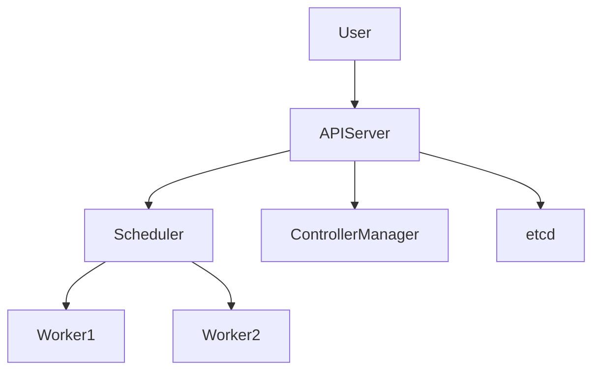
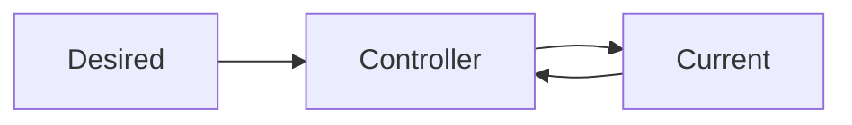
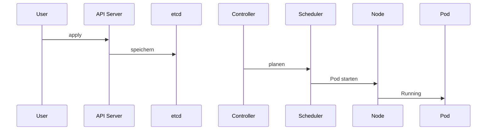

# Modul 1 – Kubernetes Architektur und Grundlagen (Professionelle Trainerunterlage)

## Dauer

- Theorie: 4 Stunden
- Hands-on Labs: 3 Stunden

## Lernziele

Nach diesem Modul können die Teilnehmer:

- die Motivation für Kubernetes erklären
- Container-Orchestrierung einordnen
- die Kubernetes-Architektur verstehen
- die Aufgaben der Control Plane beschreiben
- den Lebenszyklus eines Deployments nachvollziehen
- einen Cluster analysieren und erste Fehler erkennen

---

# 1. Von Docker zu Kubernetes

## Ausgangslage

Docker vereinfacht die Bereitstellung von Anwendungen.

Beispiel:

```bash
docker run nginx
```

Für einzelne Systeme ist dies ausreichend.

Probleme entstehen bei:

- Skalierung
- Hochverfügbarkeit
- Updates
- Service Discovery
- Betrieb vieler Container

---

# 2. Historie

## Borg

Google entwickelte Borg zur Verwaltung großer Container-Cluster.

---

## Kubernetes

2014 wurde Kubernetes veröffentlicht.

Namensherkunft:

```text
griechisch:
Steuermann
```

Abkürzung:

```text
K8s
```

---

## CNCF

Kubernetes wird von der CNCF verwaltet.

Bekannte CNCF-Projekte:

- Kubernetes
- Prometheus
- Helm
- ArgoCD
- Envoy

---

# 3. Warum Kubernetes?

## Herausforderungen ohne Orchestrierung

### Skalierung

```text
1 Container
→
100 Container
```

---

### Self-Healing

Container fällt aus.

Kubernetes startet automatisch Ersatz.

---

### Rolling Updates

Aktualisierung ohne Downtime.

---

### Service Discovery

Kommunikation über DNS statt IP.

---

# 4. Container-Orchestrierung

Definition:

> Automatisierte Verwaltung containerisierter Anwendungen.

Aufgaben:

- Deployment
- Skalierung
- Recovery
- Scheduling
- Networking

---

# 5. Kubernetes Architektur

## Überblick



---

## Komponenten

### Control Plane

- API Server
- Scheduler
- Controller Manager
- etcd

### Worker Nodes

- kubelet
- containerd
- Pods

---

# 6. API Server

Herzstück des Clusters.

Alle Komponenten kommunizieren über den API Server.

---

## Beispiel

```bash
kubectl get pods
```

Ablauf:

```text
kubectl
↓
API Server
↓
Antwort
```

---

# 7. etcd

Verteilte Key-Value Datenbank.

Speichert:

- Deployments
- Pods
- Services
- Secrets
- ConfigMaps

---

## Backup

```bash
etcdctl snapshot save backup.db
```

---

## Best Practice

Regelmäßige Snapshots.

---

# 8. Scheduler

Entscheidet:

```text
Welcher Node?
```

---

## Kriterien

- CPU
- Memory
- Affinity
- Taints
- Topology

---

## Beispiel

Node A:

```text
CPU frei: 4
RAM frei: 8GB
```

Node B:

```text
CPU frei: 0.5
RAM frei: 1GB
```

Scheduler wählt Node A.

---

# 9. Controller Manager

Verantwortlich für Reconciliation.

---

## Beispiel

Soll:

```text
3 Pods
```

Ist:

```text
2 Pods
```

Aktion:

```text
Neuen Pod starten
```

---

## Wichtige Controller

- Deployment Controller
- ReplicaSet Controller
- Job Controller
- Node Controller

---

# 10. Worker Nodes

Führen Anwendungen aus.

---

## kubelet

Agent auf jedem Node.

Aufgaben:

- Pods starten
- Status melden
- Health Checks

---

## Container Runtime

Heute meist:

```text
containerd
```

Alternativen:

- CRI-O

---

# 11. Desired State

Kubernetes arbeitet deklarativ.

---

## Beispiel

```yaml
replicas: 3
```

Kubernetes sorgt dafür, dass drei Instanzen laufen.

---

# 12. Reconciliation Loop



Kontinuierlicher Soll-Ist-Abgleich.

---

# 13. Deployment Lebenszyklus



---

# 14. Kubernetes Objektmodell

Wichtige Ressourcen:

- Pod
- Deployment
- Service
- ConfigMap
- Secret
- Namespace

---

## API Versionen

```yaml
apiVersion: apps/v1
```

---

# 15. Namespaces

Logische Trennung.

Standard:

```text
default
kube-system
kube-public
```

---

# 16. Cluster Analyse

Nodes:

```bash
kubectl get nodes
```

---

Namespaces:

```bash
kubectl get ns
```

---

Pods:

```bash
kubectl get pods -A
```

---

# 17. Kind und K3s

## Kind

Kubernetes in Docker.

Geeignet für:

- Schulungen
- Entwicklung

---

## K3s

Leichtgewichtige Distribution.

Geeignet für:

- Edge
- Labore
- Kleine Cluster

---

# Best Practices

## YAML statt Klickoberflächen

```bash
kubectl apply -f
```

---

## Cluster dokumentieren

- Architektur
- Netzwerke
- Storage

---

## etcd Backups

Pflicht im Produktivbetrieb.

---

# Lab 1 – Cluster erkunden

```bash
kubectl get nodes
kubectl get ns
kubectl get pods -A
```

---

# Lab 2 – API Ressourcen

```bash
kubectl api-resources
```

---

# Lab 3 – Cluster Informationen

```bash
kubectl cluster-info
```

---

# Lab 4 – Node Analyse

```bash
kubectl describe node
```

---

# Lab 5 – kube-system analysieren

```bash
kubectl get pods -n kube-system
```

---

# Lab 6 – API Versionen

```bash
kubectl api-versions
```

---

# Troubleshooting

## API Server nicht erreichbar

```bash
kubectl get nodes
```

Fehler:

```text
connection refused
```

---

## Node NotReady

```bash
kubectl describe node
```

---

## kubelet Fehler

Analyse:

```bash
journalctl -u kubelet
```

---

# CKA/CKAD Übungen

1. Cluster analysieren.
2. Nodes identifizieren.
3. API Ressourcen anzeigen.
4. Namespaces untersuchen.

---

# Quiz

1. Aufgabe von etcd?
2. Aufgabe des Schedulers?
3. Aufgabe des Controller Managers?
4. Was ist der Desired State?
5. Aufgabe des kubelet?
6. Unterschied Control Plane und Worker?
7. Warum Kubernetes?

---

# Lösungen

1. Speicherung des Clusterzustands
2. Node Auswahl
3. Reconciliation
4. Gewünschter Zustand
5. Verwaltung lokaler Pods
6. Steuerung vs. Ausführung
7. Automatisierung des Betriebs

---

# Zusammenfassung

Die Teilnehmer verstehen:

- Motivation für Kubernetes
- Borg und CNCF
- Kubernetes Architektur
- API Server
- Scheduler
- Controller Manager
- etcd
- kubelet
- containerd
- Desired State
- Reconciliation Loop
- Deployment Lifecycle
- Clusteranalyse
- Best Practices

Nächstes Modul:

**Modul 2 – Pods, Labels, Selectors und Namespaces**
