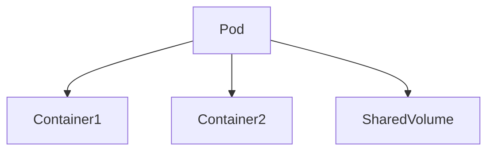
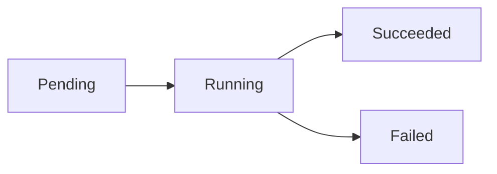
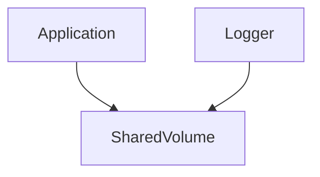

# Modul 2 – Pods, Labels, Selectors und Namespaces (Professionelle Trainerunterlage)

## Dauer

- Theorie: 4 Stunden
- Hands-on Labs: 3 Stunden

## Lernziele

Nach diesem Modul können die Teilnehmer:

- Pods als zentrale Kubernetes-Ressource verstehen
- Multi-Container-Pods einsetzen
- Init-Container und Sidecars erklären
- Labels und Selectors professionell nutzen
- Namespaces strukturieren
- Pod-Probleme analysieren und beheben

---

# 1. Was ist ein Pod?

Ein Pod ist die kleinste deploybare Einheit in Kubernetes.

Ein Pod kann:

- einen Container enthalten
- mehrere Container enthalten

---

## Pod Architektur



Gemeinsam genutzt:

- Netzwerk
- IP-Adresse
- Storage

---

# 2. Warum Pods?

Container benötigen häufig gemeinsame Ressourcen.

Beispiel:

```text
Webserver
Logging Agent
```

Beide laufen im gleichen Pod.

---

# 3. Pod Lifecycle

Status:

```text
Pending
Running
Succeeded
Failed
Unknown
```

---

## Ablauf



---

# 4. Pod Manifest

```yaml
apiVersion: v1
kind: Pod
metadata:
  name: nginx
spec:
  containers:
  - name: nginx
    image: nginx
```

---

## Deployment

```bash
kubectl apply -f pod.yaml
```

---

# 5. Logs und Debugging

Logs anzeigen:

```bash
kubectl logs nginx
```

Live:

```bash
kubectl logs -f nginx
```

---

## Shell Zugriff

```bash
kubectl exec -it nginx -- sh
```

---

# 6. Multi-Container Pods

Ein Pod kann mehrere Container enthalten.

---

## Sidecar Pattern



---

### Typische Sidecars

- Logging
- Monitoring
- Proxy

---

# 7. Ambassador Pattern

Proxy zwischen Anwendung und externem Dienst.

```text
Application
    |
Ambassador
    |
External Service
```

---

# 8. Adapter Pattern

Transformation von Datenformaten.

Beispiel:

```text
Application -> Adapter -> Monitoring
```

---

# 9. Init Container

Init Container werden vor den Hauptcontainern ausgeführt.

---

## Beispiel

```yaml
initContainers:
- name: init-db
  image: busybox
```

---

## Anwendungsfälle

- Daten vorbereiten
- Datenbank prüfen
- Konfiguration erzeugen

---

# 10. Labels

Labels sind Schlüssel-Wert-Paare.

```yaml
labels:
  app: webshop
  env: prod
```

---

## Vorteile

- Organisation
- Selektion
- Automatisierung

---

# 11. Label Strategien

Empfohlene Labels:

```yaml
app: webshop
env: prod
team: platform
version: v1
```

---

# 12. Selectors

Services und Deployments verwenden Selectors.

```yaml
selector:
  app: webshop
```

---

## Match Expressions

```yaml
matchExpressions:
- key: env
  operator: In
  values:
  - prod
```

---

# 13. Annotations

Nicht selektierbare Metadaten.

```yaml
annotations:
  owner: team-platform
```

---

## Verwendung

- Dokumentation
- Tooling
- CI/CD Informationen

---

# 14. Namespaces

Namespaces organisieren Ressourcen logisch.

---

## Standard Namespaces

```text
default
kube-system
kube-public
kube-node-lease
```

---

# 15. Namespace Strategien

Typische Struktur:

```text
dev
test
stage
prod
```

---

## Team Struktur

```text
team-a
team-b
team-c
```

---

# 16. Resource Quotas

Ressourcen pro Namespace begrenzen.

```yaml
apiVersion: v1
kind: ResourceQuota
metadata:
  name: quota
spec:
  hard:
    pods: "20"
```

---

# 17. LimitRanges

Standardwerte definieren.

```yaml
kind: LimitRange
```

---

# 18. Security Context

Container härten.

```yaml
securityContext:
  runAsNonRoot: true
```

---

## Best Practice

Keine Container als Root starten.

---

# 19. QoS Klassen

Kubernetes unterscheidet:

```text
Guaranteed
Burstable
BestEffort
```

---

## Bedeutung

Beeinflusst OOM-Killer Verhalten.

---

# 20. Pod Networking

Jeder Pod erhält eine IP-Adresse.

```text
10.42.1.10
10.42.1.11
```

Details folgen in Modul 4.

---

# Best Practices

## Labels standardisieren

```yaml
app:
env:
team:
version:
```

---

## Keine Einzelpods

Statt:

```yaml
kind: Pod
```

Produktiv:

```yaml
kind: Deployment
```

---

## Init Container nutzen

Für Startabhängigkeiten.

---

# Lab 1 – Erster Pod

Pod erstellen.

```bash
kubectl apply -f pod.yaml
```

---

# Lab 2 – Logs analysieren

```bash
kubectl logs nginx
```

---

# Lab 3 – Exec

```bash
kubectl exec -it nginx -- sh
```

---

# Lab 4 – Labels

Labels setzen und filtern.

```bash
kubectl get pods -l app=webshop
```

---

# Lab 5 – Namespaces

Namespace erstellen.

```bash
kubectl create ns training
```

---

# Lab 6 – Init Container

Init Container analysieren.

---

# Lab 7 – Resource Quota

Namespace begrenzen.

---

# Troubleshooting

## ImagePullBackOff

```bash
kubectl describe pod
```

---

## CrashLoopBackOff

```bash
kubectl logs
```

---

## Pending

Analyse:

```bash
kubectl describe pod
```

---

## Namespace Fehler

```bash
kubectl config view
```

---

# CKA/CKAD Übungen

1. Pod erstellen.
2. Namespace anlegen.
3. Labels setzen.
4. Selector verwenden.
5. Init Container konfigurieren.
6. ResourceQuota definieren.

---

# Quiz

1. Was ist ein Pod?
2. Warum Multi-Container Pods?
3. Aufgabe von Init Containern?
4. Unterschied Labels und Annotations?
5. Aufgabe von Namespaces?
6. Wozu dienen Resource Quotas?
7. Was bedeutet QoS?

---

# Lösungen

1. Kleinste deploybare Einheit
2. Gemeinsame Ressourcen
3. Vorbereitung des Starts
4. Selektierbar vs. nicht selektierbar
5. Logische Trennung
6. Ressourcenbegrenzung
7. Resource Quality Klassen

---

# Zusammenfassung

Die Teilnehmer verstehen:

- Pods
- Pod Lifecycle
- Multi-Container Pods
- Sidecars
- Ambassador Pattern
- Adapter Pattern
- Init Container
- Labels
- Selectors
- Annotations
- Namespaces
- Resource Quotas
- LimitRanges
- Security Contexts
- QoS Klassen

Nächstes Modul:

**Modul 3 – Deployments und ReplicaSets**
