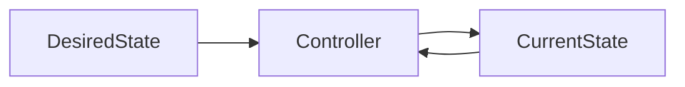
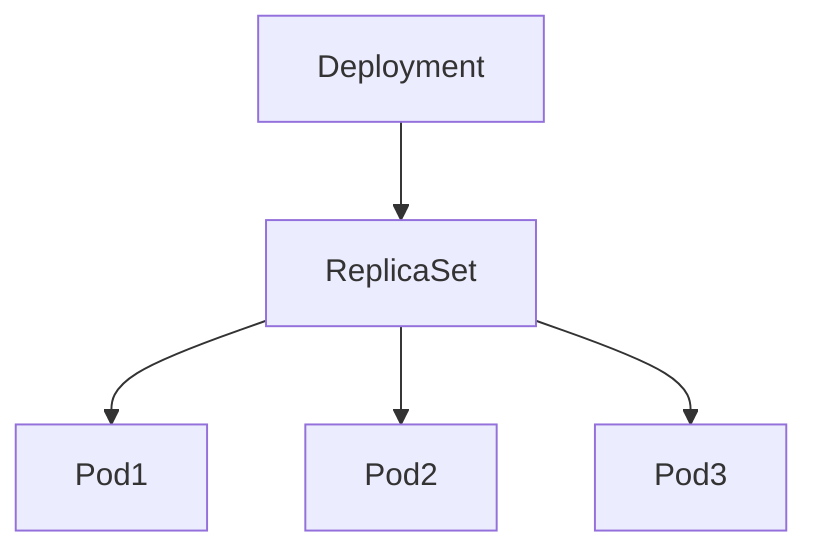
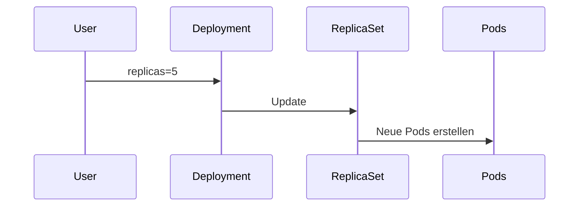
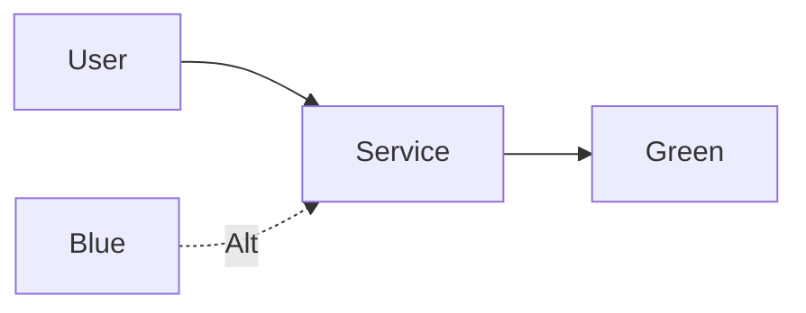
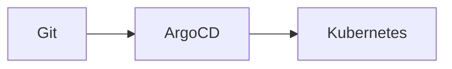

# Modul 3 – Deployments und ReplicaSets (Professionelle Trainerunterlage)

## Dauer

- Theorie: 4 Stunden
- Hands-on Labs: 3 Stunden

## Lernziele

Nach diesem Modul können die Teilnehmer:

- den Zweck von Deployments verstehen
- ReplicaSets gezielt einsetzen
- Rollouts und Rollbacks durchführen
- Deployment-Strategien vergleichen
- Blue/Green- und Canary-Deployments erklären
- produktionsreife Deployments erstellen

---

# 1. Das Problem mit einzelnen Pods

Pods sind vergänglich.

```bash
kubectl delete pod nginx
```

Nach dem Löschen existiert der Pod nicht mehr.

Kubernetes benötigt einen Controller, um den gewünschten Zustand sicherzustellen.

---

# 2. Desired State und Reconciliation

Kubernetes arbeitet deklarativ.

Beispiel:

```yaml
replicas: 3
```

Das System sorgt dafür, dass immer drei Instanzen existieren.

---

## Reconciliation Loop



---

# 3. ReplicaSets

ReplicaSets stellen sicher:

```text
Soll = Ist
```

---

## ReplicaSet Beispiel

```yaml
apiVersion: apps/v1
kind: ReplicaSet
metadata:
  name: nginx-rs
spec:
  replicas: 3
  selector:
    matchLabels:
      app: nginx
  template:
    metadata:
      labels:
        app: nginx
    spec:
      containers:
      - name: nginx
        image: nginx
```

---

## Verhalten

```text
3 Pods definiert
1 Pod gelöscht
↓
ReplicaSet erstellt neuen Pod
```

---

# 4. Deployments

Deployments verwalten ReplicaSets.

In produktiven Umgebungen werden Deployments fast immer verwendet.

---

## Architektur



---

# 5. Erstes Deployment

```yaml
apiVersion: apps/v1
kind: Deployment
metadata:
  name: webshop
spec:
  replicas: 3
  selector:
    matchLabels:
      app: webshop
  template:
    metadata:
      labels:
        app: webshop
    spec:
      containers:
      - name: webshop
        image: nginx:1.25
```

---

## Deployment anwenden

```bash
kubectl apply -f deployment.yaml
```

---

# 6. Deployment analysieren

```bash
kubectl get deployments
```

```bash
kubectl get rs
```

```bash
kubectl get pods
```

---

# 7. Skalierung

Deployment vergrößern.

```bash
kubectl scale deployment webshop --replicas=5
```

---

## Skalierungsablauf



---

# 8. Rolling Updates

Ziel:

Updates ohne Downtime.

---

## Image aktualisieren

```bash
kubectl set image deployment/webshop \
webshop=nginx:1.26
```

---

## Rollout beobachten

```bash
kubectl rollout status deployment/webshop
```

---

# 9. Rollback

Fehlerhafte Releases zurücknehmen.

---

Historie:

```bash
kubectl rollout history deployment/webshop
```

Rollback:

```bash
kubectl rollout undo deployment/webshop
```

---

# 10. Deployment Strategien

## RollingUpdate

Standard.

```yaml
strategy:
  type: RollingUpdate
```

---

## Recreate

```yaml
strategy:
  type: Recreate
```

Eigenschaften:

- Alte Pods stoppen
- Neue Pods starten
- Downtime

---

# 11. RollingUpdate Parameter

```yaml
strategy:
  rollingUpdate:
    maxSurge: 1
    maxUnavailable: 0
```

---

## maxSurge

Zusätzliche Pods während Updates.

---

## maxUnavailable

Wie viele Pods gleichzeitig ausfallen dürfen.

---

# 12. Deployment Conditions

```bash
kubectl describe deployment webshop
```

Beispiele:

- Available
- Progressing
- ReplicaFailure

---

# 13. Blue/Green Deployment

Prinzip:

```text
Blue = Alt
Green = Neu
```

Traffic wird umgeschaltet.

---

## Architektur



---

## Vorteile

- Sofortiger Rollback
- Geringes Risiko

---

# 14. Canary Deployment

Neue Version nur für Teil der Nutzer.

```text
90% -> Version 1
10% -> Version 2
```

---

## Vorteile

- Frühe Fehlererkennung
- Kontrollierte Einführung

---

# 15. Progressive Delivery

Werkzeuge:

- Argo Rollouts
- Flagger

Erweiterung klassischer Deployments.

---

# 16. PodDisruptionBudgets

Verhindern zu viele gleichzeitige Ausfälle.

```yaml
apiVersion: policy/v1
kind: PodDisruptionBudget
metadata:
  name: webshop-pdb
spec:
  minAvailable: 2
```

---

# 17. Ressourcenmanagement

```yaml
resources:
  requests:
    cpu: 250m
    memory: 256Mi
  limits:
    cpu: 500m
    memory: 512Mi
```

---

# 18. Anti-Affinity

Verteilung auf verschiedene Nodes.

```yaml
podAntiAffinity:
```

Erhöht Hochverfügbarkeit.

---

# 19. GitOps

Deployments im Git Repository verwalten.

Werkzeuge:

- ArgoCD
- FluxCD

---

## GitOps Workflow



---

# Best Practices

## Immer YAML verwenden

Nicht:

```bash
kubectl run
```

Sondern:

```bash
kubectl apply -f deployment.yaml
```

---

## Rollout überwachen

```bash
kubectl rollout status deployment/webshop
```

---

## Requests und Limits setzen

Pflicht im Produktivbetrieb.

---

# Lab 1 – Deployment erstellen

Deployment deployen.

---

# Lab 2 – Skalieren

3 → 5 Pods.

---

# Lab 3 – Rolling Update

Image aktualisieren.

---

# Lab 4 – Rollback

Fehlerhafte Version zurückrollen.

---

# Lab 5 – Blue/Green Simulation

Service umschalten.

---

# Lab 6 – PodDisruptionBudget

Wartungsfenster simulieren.

---

# Lab 7 – Deployment Analyse

Events und Conditions untersuchen.

---

# Troubleshooting

## Deployment hängt

```bash
kubectl describe deployment
```

---

## ImagePullBackOff

```bash
kubectl describe pod
```

---

## CrashLoopBackOff

```bash
kubectl logs
```

---

## Rollout hängt

```bash
kubectl rollout status deployment
```

---

# CKA/CKAD Übungen

1. Deployment erstellen.
2. Deployment skalieren.
3. Rollback durchführen.
4. Rolling Update konfigurieren.
5. PDB anlegen.

---

# Quiz

1. Warum Deployments statt Pods?
2. Was macht ein ReplicaSet?
3. Was bedeutet Reconciliation?
4. Unterschied RollingUpdate/Recreate?
5. Vorteil von Blue/Green?
6. Vorteil von Canary?
7. Aufgabe eines PDB?

---

# Lösungen

1. Selbstheilung und Updates
2. Replica-Anzahl sicherstellen
3. Soll-Ist-Abgleich
4. Downtime vs. ohne Downtime
5. Sofortiger Rollback
6. Risiko minimieren
7. Schutz vor zu vielen Ausfällen

---

# Zusammenfassung

Die Teilnehmer verstehen:

- ReplicaSets
- Deployments
- Rollouts
- Rollbacks
- Deployment Strategien
- Blue/Green
- Canary
- Progressive Delivery
- PodDisruptionBudgets
- GitOps
- Troubleshooting

Nächstes Modul:

**Modul 4 – Services und Kubernetes Networking**
