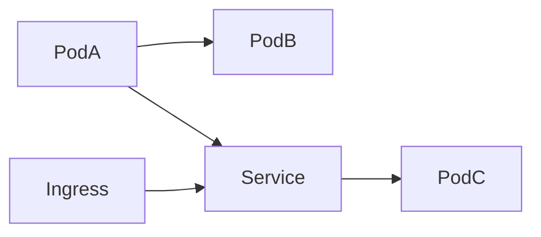
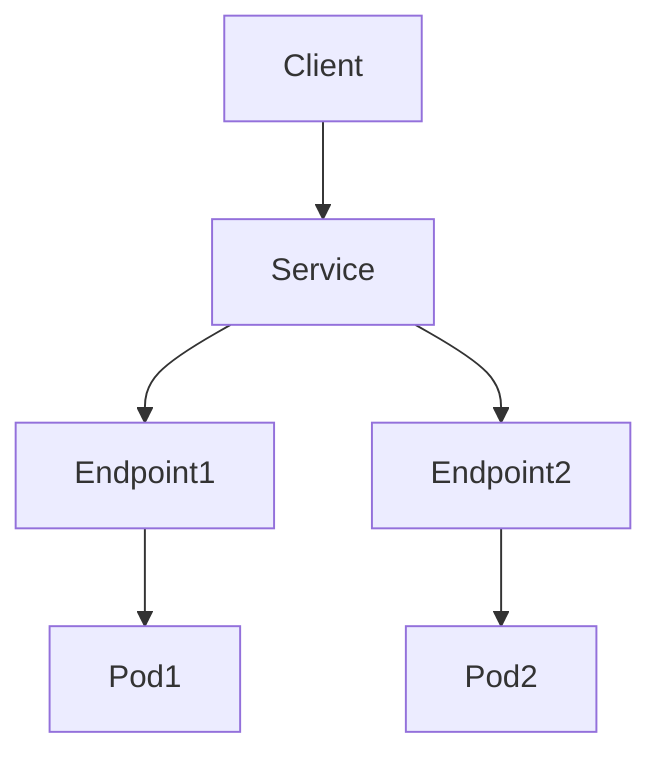
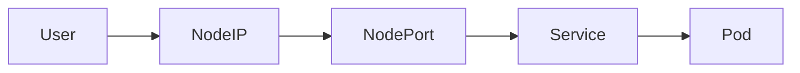
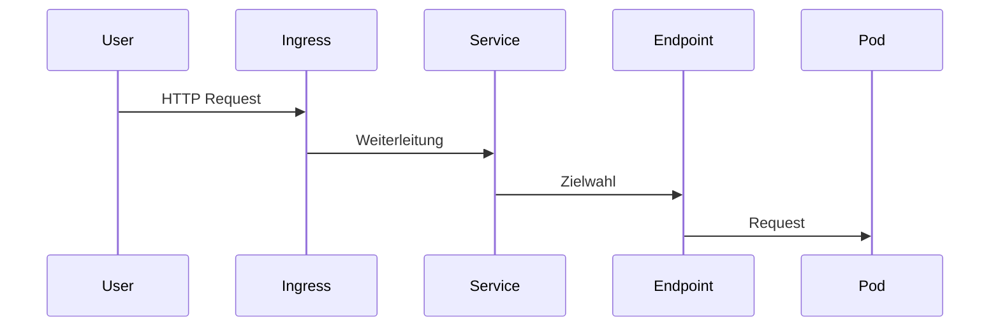

# Modul 4 – Services und Kubernetes Networking (Professionelle Trainerunterlage)

## Dauer

- Theorie: 4 Stunden
- Hands-on Labs: 3 Stunden

## Lernziele

Nach diesem Modul können die Teilnehmer:

- das Kubernetes-Netzwerkmodell erklären
- Services produktiv einsetzen
- Service-Typen unterscheiden
- DNS und Service Discovery verstehen
- kube-proxy analysieren
- CNI-Plugins einordnen
- Netzwerkprobleme systematisch analysieren

---

# 1. Kubernetes Netzwerkmodell

Grundsatz:

> Jeder Pod besitzt eine eigene IP-Adresse.

Dadurch können Pods direkt miteinander kommunizieren.

## Anforderungen

- Pod ↔ Pod Kommunikation
- Node ↔ Pod Kommunikation
- Externe ↔ Pod Kommunikation

---

## Netzwerkmodell



---

# 2. Das Problem flüchtiger Pods

Pods werden regelmäßig neu erstellt.

```text
Vorher:
10.42.1.15

Nach Neustart:
10.42.2.88
```

Direkte IP-Adressen sind daher ungeeignet.

---

# 3. Services Deep Dive

Ein Service bietet:

- stabile IP
- DNS-Namen
- Load Balancing
- Service Discovery

---

## Service Architektur



---

# 4. ClusterIP

Standardtyp.

```yaml
apiVersion: v1
kind: Service
metadata:
  name: webshop
spec:
  selector:
    app: webshop
  ports:
  - port: 80
    targetPort: 8080
```

---

## DNS Auflösung

```text
webshop.default.svc.cluster.local
```

---

# 5. NodePort

Externer Zugriff über Node-Port.

```yaml
type: NodePort
```

Portbereich:

```text
30000 - 32767
```

---

## Datenfluss



---

# 6. LoadBalancer

Cloud-basierter Service.

```yaml
type: LoadBalancer
```

Unterstützt:

- AWS ELB
- Azure Load Balancer
- Google Cloud Load Balancer

---

# 7. ExternalName

DNS Alias.

```yaml
type: ExternalName
externalName: db.company.local
```

---

# 8. Headless Services

```yaml
clusterIP: None
```

Keine virtuelle IP.

Verwendung:

- StatefulSets
- Kafka
- PostgreSQL Cluster
- Elasticsearch

---

# 9. Endpoints

Services nutzen Endpoints als Backend-Liste.

```bash
kubectl get endpoints
```

Beispiel:

```text
10.42.1.10
10.42.1.11
10.42.1.12
```

---

# 10. kube-proxy

Verantwortlich für Service-Routing.

Modi:

## iptables

Historischer Standard.

## IPVS

Performanter bei vielen Services.

---

# 11. CoreDNS

DNS-Service des Clusters.

```bash
kubectl get pods -n kube-system
```

---

## DNS Test

```bash
kubectl exec -it dnsutils -- nslookup webshop
```

---

# 12. Service Discovery

Anwendungen kommunizieren über DNS.

Nicht:

```text
10.42.1.12
```

Sondern:

```text
postgres.database.svc.cluster.local
```

---

# 13. CNI Plugins

Container Network Interface.

Bekannte Lösungen:

## Flannel

Einfach.

## Calico

Beliebt für Network Policies.

## Cilium

eBPF-basiert.

---

## Vergleich

| Plugin | Besonderheit |
|----------|-------------|
| Flannel | Einfach |
| Calico | Policies |
| Cilium | eBPF |

---

# 14. Network Policies

Segmentierung des Datenverkehrs.

Beispiel:

```yaml
apiVersion: networking.k8s.io/v1
kind: NetworkPolicy
metadata:
  name: deny-all
spec:
  podSelector: {}
  policyTypes:
  - Ingress
```

---

## Zero Trust Ansatz

Standard:

```text
deny all
```

Danach gezielt erlauben.

---

# 15. Paketfluss



---

# 16. Troubleshooting Methodik

Schritt 1

```bash
kubectl get svc
```

Schritt 2

```bash
kubectl get endpoints
```

Schritt 3

```bash
kubectl describe svc
```

Schritt 4

```bash
kubectl logs
```

---

# 17. Wireshark & tcpdump

Analyse direkt im Container.

```bash
tcpdump -i eth0
```

---

# Best Practices

## DNS statt IP

Immer DNS-Namen verwenden.

---

## Labels konsistent halten

```yaml
app: webshop
tier: frontend
env: prod
```

---

## Health Checks einsetzen

Nur gesunde Pods sollten Traffic erhalten.

---

## Network Policies verwenden

Besonders in Multi-Tenant-Clustern.

---

# Lab 1 – ClusterIP

Service erstellen und testen.

---

# Lab 2 – DNS Analyse

```bash
nslookup webshop
```

---

# Lab 3 – NodePort

Anwendung extern bereitstellen.

---

# Lab 4 – Headless Service

Stateful Service analysieren.

---

# Lab 5 – Network Policy

Traffic blockieren.

---

# Lab 6 – DNS Fehleranalyse

CoreDNS untersuchen.

---

# Lab 7 – Service ohne Endpoints

Fehlerhafte Labels identifizieren.

---

# CKA/CKAD Übungen

1. ClusterIP Service erstellen.
2. NodePort bereitstellen.
3. DNS Problem analysieren.
4. Network Policy konfigurieren.
5. Headless Service erstellen.

---

# Quiz

1. Warum benötigen wir Services?
2. Unterschied ClusterIP und NodePort?
3. Aufgabe von kube-proxy?
4. Aufgabe von CoreDNS?
5. Wann Headless Services?
6. Warum Network Policies?
7. Unterschied Calico und Cilium?

---

# Lösungen

1. Stabile Erreichbarkeit
2. Intern vs. Extern
3. Routing
4. DNS
5. Stateful Workloads
6. Segmentierung
7. Policy vs. eBPF Fokus

---

# Zusammenfassung

Die Teilnehmer verstehen:

- Kubernetes Networking
- Services
- ClusterIP
- NodePort
- LoadBalancer
- Headless Services
- Endpoints
- CoreDNS
- kube-proxy
- CNI Plugins
- Network Policies
- Troubleshooting

Nächstes Modul:

**Modul 5 – ConfigMaps und Secrets**
