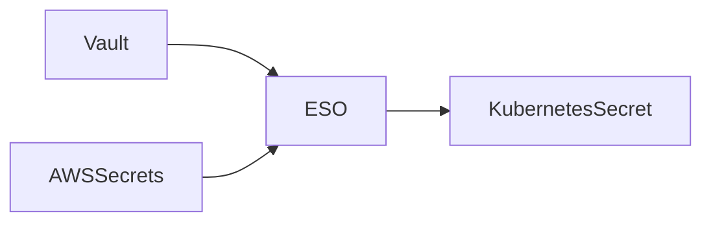
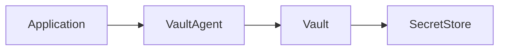

# Modul 5 – ConfigMaps und Secrets (Professionelle Trainerunterlage)

## Dauer

- Theorie: 4 Stunden
- Hands-on Labs: 3 Stunden

## Lernziele

Nach diesem Modul können die Teilnehmer:

- Konfiguration und Applikationscode sauber trennen
- ConfigMaps und Secrets produktiv einsetzen
- verschiedene Secret-Typen unterscheiden
- Konfigurationsänderungen sicher ausrollen
- GitOps-fähige Secret-Strategien bewerten
- Vault-, Sealed-Secret- und External-Secret-Konzepte verstehen

---

# 1. Twelve-Factor-App und Konfigurationsmanagement

Grundsatz:

> Konfiguration gehört nicht in den Anwendungscode.

Falsch:

```yaml
database:
  host: db01
  password: geheim123
```

Richtig:

```yaml
database:
  host: ${DB_HOST}
  password: ${DB_PASSWORD}
```

---

# 2. ConfigMaps Deep Dive

ConfigMaps speichern nicht-sensitive Konfiguration.

Typische Inhalte:

- Feature Flags
- URLs
- Hostnamen
- Log-Level
- Anwendungskonfiguration

---

## ConfigMap erstellen

```yaml
apiVersion: v1
kind: ConfigMap
metadata:
  name: webshop-config
data:
  APP_ENV: production
  LOG_LEVEL: info
  FEATURE_CHECKOUT_V2: "true"
```

---

## ConfigMap aus Datei

```bash
kubectl create configmap nginx-config \
  --from-file=nginx.conf
```

---

## ConfigMap als Volume

```yaml
volumes:
- name: config-volume
  configMap:
    name: webshop-config
```

---

# 3. Immutable ConfigMaps

Seit Kubernetes können ConfigMaps als unveränderlich markiert werden.

```yaml
immutable: true
```

Vorteile:

- bessere Performance
- Schutz vor Fehlbedienung

---

# 4. Secrets Deep Dive

Secrets enthalten sensible Daten.

Beispiele:

- Datenbank-Passwörter
- API Keys
- Zertifikate
- Tokens

---

## Wichtiger Hinweis

Secrets sind standardmäßig lediglich Base64-kodiert.

```text
Base64 != Verschlüsselung
```

Daher:

- etcd Encryption aktivieren
- Zugriff einschränken

---

# 5. Secret Typen

## Opaque

Standardtyp.

```yaml
type: Opaque
```

---

## TLS Secret

```bash
kubectl create secret tls tls-secret \
  --cert=tls.crt \
  --key=tls.key
```

---

## Docker Registry Secret

```bash
kubectl create secret docker-registry regcred
```

Verwendung für private Container Registries.

---

## Service Account Token

Automatisch durch Kubernetes erzeugt.

---

# 6. Secret Verwendung

## Als Environment Variable

```yaml
env:
- name: DB_PASSWORD
  valueFrom:
    secretKeyRef:
      name: db-secret
      key: password
```

---

## Als Datei

```yaml
volumes:
- name: secret-volume
  secret:
    secretName: db-secret
```

---

# 7. Secret Rotation

Problem:

```text
Passwort geändert
```

Pods verwenden weiterhin alten Wert.

Lösungen:

- Rolling Restart
- Reloader Controller
- External Secrets

---

# 8. External Secrets Operator

Architektur:



Vorteile:

- Keine Secrets im Git Repository
- Zentrale Verwaltung

---

# 9. Sealed Secrets

Konzept:

```text
Secret
 ↓
Verschlüsseln
 ↓
Git Repository
 ↓
Controller entschlüsselt
```

Geeignet für GitOps.

---

# 10. HashiCorp Vault

Enterprise-Ansatz.

Features:

- Dynamic Secrets
- Secret Rotation
- Auditing
- PKI

---

## Beispielarchitektur



---

# 11. GitOps Best Practices

Nicht:

```yaml
password: supersecret
```

Im Git Repository speichern.

Sondern:

- Sealed Secrets
- External Secrets
- Vault

---

# 12. Config Reloading

Problem:

ConfigMap wird geändert.

Pod bemerkt Änderung nicht automatisch.

Möglichkeiten:

- Rollout Restart
- Sidecar Reloader
- Application Hot Reload

---

# 13. Security Best Practices

## RBAC

Nur berechtigte Benutzer dürfen Secrets lesen.

---

## Encryption at Rest

etcd verschlüsseln.

---

## Least Privilege

Nur benötigte Rechte vergeben.

---

## Secret Scanning

Tools:

- Trivy
- GitGuardian
- Gitleaks

---

# Lab 1 – ConfigMap als Environment Variable

Aufgabe:

- ConfigMap erstellen
- Deployment anbinden
- Werte prüfen

---

# Lab 2 – ConfigMap als Datei

Datei mounten.

Prüfen:

```bash
kubectl exec -it pod -- cat /config/app.conf
```

---

# Lab 3 – Secret verwenden

Passwort aus Secret lesen.

```bash
kubectl exec -it pod -- env
```

---

# Lab 4 – TLS Secret

TLS Secret erzeugen und analysieren.

---

# Lab 5 – Docker Registry Secret

Private Registry anbinden.

---

# Lab 6 – Secret Rotation

Secret ändern und Rollout durchführen.

---

# Troubleshooting

## Secret nicht gefunden

```bash
kubectl describe pod
```

---

## Falscher Key

```bash
kubectl get secret db-secret -o yaml
```

---

## Mount fehlgeschlagen

```bash
kubectl describe pod
```

Events prüfen.

---

## Registry Login Fehler

```text
ImagePullBackOff
```

Kontrolle:

```bash
kubectl describe pod
```

---

# CKA/CKAD Prüfungsfragen

1. Secret als Umgebungsvariable einbinden.
2. ConfigMap als Datei mounten.
3. Docker Registry Secret verwenden.
4. Secret aktualisieren und Rollout durchführen.

---

# Quiz

1. Warum ConfigMaps?
2. Warum sind Secrets nicht automatisch sicher?
3. Was ist der Unterschied zwischen Opaque und TLS Secrets?
4. Wann sollte Vault verwendet werden?
5. Welche Vorteile bieten Sealed Secrets?
6. Was macht der External Secrets Operator?
7. Warum ist Secret Rotation wichtig?

---

# Lösungen

1. Trennung von Code und Konfiguration
2. Base64 ist keine Verschlüsselung
3. TLS enthält Zertifikate
4. Bei zentralem Secret Management
5. GitOps-fähige Speicherung
6. Synchronisation externer Secret Stores
7. Reduktion von Sicherheitsrisiken

---

# Zusammenfassung

Die Teilnehmer verstehen:

- ConfigMaps
- Immutable ConfigMaps
- Secret Typen
- Secret Mounts
- Secret Rotation
- External Secrets
- Sealed Secrets
- Vault
- GitOps Strategien
- Security Best Practices

Nächstes Modul:

**Modul 6 – Persistente Daten, PV, PVC und Storage Classes**
