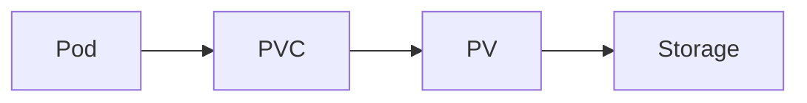
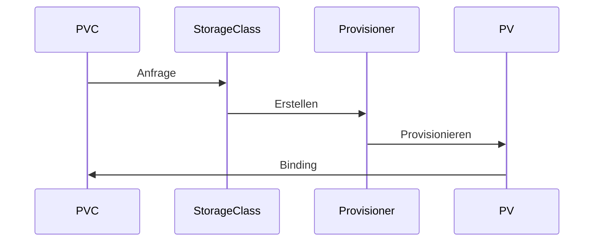
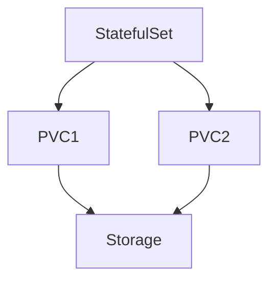

# Modul 6 – Persistente Daten, PV, PVC und Storage Classes (Professionelle Trainerunterlage)

## Dauer

- Theorie: 4 Stunden
- Hands-on Labs: 3 Stunden

## Lernziele

Nach diesem Modul können die Teilnehmer:

- die Storage-Konzepte von Kubernetes verstehen
- Volumes von Persistent Volumes unterscheiden
- PVCs korrekt einsetzen
- Storage Classes konfigurieren
- Dynamic Provisioning verstehen
- Stateful Workloads betreiben
- Storage-Probleme analysieren

---

# 1. Das Problem persistenter Daten

Container sind grundsätzlich flüchtig.

Beispiel:

```text
Container gelöscht
↓
Daten verloren
```

Für Datenbanken ist dies nicht akzeptabel.

---

# 2. Kubernetes Storage Architektur



---

# 3. Volumes

Volumes existieren innerhalb eines Pods.

---

## emptyDir

Lebensdauer:

```text
Pod lebt
↓
Volume lebt
```

Pod gelöscht:

```text
Volume gelöscht
```

---

## Beispiel

```yaml
volumes:
- name: cache
  emptyDir: {}
```

---

# 4. hostPath

Bindet lokales Node-Dateisystem ein.

```yaml
hostPath:
  path: /data
```

---

## Nachteile

- Node-Abhängigkeit
- Nicht hochverfügbar

---

# 5. Persistent Volumes

PV = tatsächlicher Speicher.

Administrator definiert Speicherressourcen.

---

## Beispiel

```yaml
apiVersion: v1
kind: PersistentVolume
metadata:
  name: pv-demo
spec:
  capacity:
    storage: 10Gi
```

---

# 6. Persistent Volume Claims

Anwendungen fordern Speicher an.

---

## Beispiel

```yaml
apiVersion: v1
kind: PersistentVolumeClaim
metadata:
  name: pvc-demo
spec:
  accessModes:
    - ReadWriteOnce
  resources:
    requests:
      storage: 5Gi
```

---

# 7. Binding

Kubernetes verbindet PVC mit PV.

```text
PVC 5Gi
↓
PV 10Gi
↓
Bound
```

---

# 8. Access Modes

## ReadWriteOnce (RWO)

Ein Node.

---

## ReadOnlyMany (ROX)

Viele Nodes lesen.

---

## ReadWriteMany (RWX)

Viele Nodes schreiben.

---

# 9. Reclaim Policies

## Retain

Daten bleiben erhalten.

---

## Delete

Storage wird entfernt.

---

## Recycle

Historisch, kaum genutzt.

---

# 10. Storage Classes

Automatische Bereitstellung von Storage.

---

## Beispiel

```yaml
apiVersion: storage.k8s.io/v1
kind: StorageClass
metadata:
  name: fast
```

---

# 11. Dynamic Provisioning

Früher:

```text
PV manuell erstellen
```

Heute:

```text
PVC erzeugen
↓
PV automatisch
```

---

## Ablauf



---

# 12. CSI (Container Storage Interface)

Standardisierte Storage-Schnittstelle.

---

## Vorteile

- Herstellerunabhängig
- Erweiterbar
- Cloud-native

---

## Beispiele

- AWS EBS CSI
- Azure Disk CSI
- Ceph CSI
- Longhorn CSI

---

# 13. StatefulSets

Stateful Anwendungen benötigen stabile Volumes.

---

## Beispiele

- PostgreSQL
- MySQL
- MongoDB
- Kafka

---

## Architektur



---

# 14. NFS

Klassische Shared Storage Lösung.

Eigenschaften:

- RWX möglich
- Einfach
- Weit verbreitet

---

# 15. Ceph

Enterprise Storage Plattform.

Features:

- Replikation
- Hochverfügbarkeit
- Skalierbarkeit

---

# 16. Longhorn

Cloud-native Storage.

Entwickelt von:

```text
SUSE / Rancher
```

Vorteile:

- Kubernetes-native
- Einfaches Management

---

# 17. Backup Strategien

Speicher alleine genügt nicht.

---

## Werkzeuge

- Velero
- Restic
- Kasten

---

## Best Practice

Regelmäßig testen:

```text
Backup
↓
Restore
↓
Validierung
```

---

# 18. Disaster Recovery

Fragen:

- Wo liegen Backups?
- Wie schnell erfolgt Restore?
- Welche Daten dürfen verloren gehen?

---

# Best Practices

## Dynamic Provisioning

Immer bevorzugen.

---

## StorageClass definieren

Keine manuelle PV-Verwaltung.

---

## StatefulSets für Datenbanken

Nicht Deployments verwenden.

---

## Backup testen

Restore wichtiger als Backup.

---

# Lab 1 – emptyDir

Volume erstellen und testen.

---

# Lab 2 – PV anlegen

Persistent Volume erstellen.

---

# Lab 3 – PVC anlegen

Claim erstellen und binden.

---

# Lab 4 – Deployment mit PVC

Persistente Anwendung deployen.

---

# Lab 5 – StorageClass

Dynamisches Provisioning testen.

---

# Lab 6 – StatefulSet

PostgreSQL StatefulSet erstellen.

---

# Lab 7 – Restore Test

Backup simulieren.

---

# Troubleshooting

## PVC Pending

Analyse:

```bash
kubectl describe pvc
```

---

## PV nicht gebunden

```bash
kubectl get pv
```

---

## Mount Fehler

```bash
kubectl describe pod
```

---

## StorageClass fehlt

```bash
kubectl get storageclass
```

---

# CKA/CKAD Übungen

1. PV erstellen.
2. PVC erstellen.
3. PVC in Pod einbinden.
4. StorageClass verwenden.
5. StatefulSet deployen.

---

# Quiz

1. Unterschied PV und PVC?
2. Was ist Dynamic Provisioning?
3. Aufgabe einer StorageClass?
4. Unterschied RWO und RWX?
5. Warum StatefulSets?
6. Was ist CSI?
7. Warum Backups testen?

---

# Lösungen

1. Speicher vs. Speicheranforderung
2. Automatische PV-Erstellung
3. Definition von Speicherprofilen
4. Einzelner vs. mehrere Writer
5. Persistente Identitäten
6. Storage Schnittstelle
7. Backup ohne Restore ist wertlos

---

# Zusammenfassung

Die Teilnehmer verstehen:

- Volumes
- emptyDir
- hostPath
- PV
- PVC
- Access Modes
- Reclaim Policies
- Storage Classes
- Dynamic Provisioning
- CSI
- StatefulSets
- NFS
- Ceph
- Longhorn
- Backup & Recovery

Nächstes Modul:

**Modul 7 – Ressourcenmanagement, Probes und Autoscaling**
