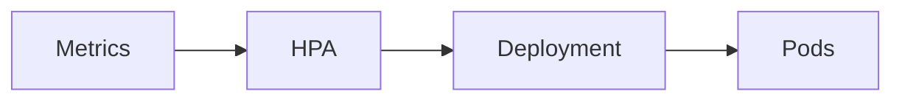
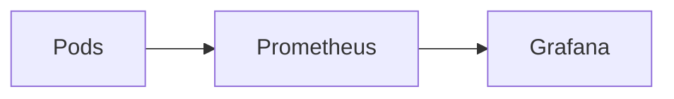

# Modul 7 – Ressourcenmanagement, Probes und Autoscaling (Professionelle Trainerunterlage)

## Dauer

- Theorie: 4 Stunden
- Hands-on Labs: 3 Stunden

## Lernziele

Nach diesem Modul können die Teilnehmer:

- Ressourcenanforderungen korrekt definieren
- Requests und Limits unterscheiden
- QoS-Klassen verstehen
- Liveness-, Readiness- und Startup-Probes einsetzen
- HPA, VPA und Cluster Autoscaler erklären
- Performance- und Stabilitätsprobleme analysieren

---

# 1. Warum Ressourcenmanagement?

Container konkurrieren um:

- CPU
- Arbeitsspeicher
- Netzwerk
- Storage

Ohne Limits kann ein Container andere Anwendungen beeinträchtigen.

---

# 2. Resource Requests

Requests definieren garantierte Ressourcen.

```yaml
resources:
  requests:
    cpu: 250m
    memory: 256Mi
```

---

## Bedeutung

Scheduler berücksichtigt Requests bei der Platzierung.

---

# 3. Resource Limits

Limits definieren die maximale Nutzung.

```yaml
resources:
  limits:
    cpu: 500m
    memory: 512Mi
```

---

## CPU

Container wird gedrosselt.

---

## Memory

Container wird beendet.

```text
OOMKilled
```

---

# 4. Requests vs. Limits

| Typ | Bedeutung |
|------|------------|
| Request | Garantiert |
| Limit | Maximum |

---

# 5. QoS Klassen

Kubernetes unterscheidet:

- Guaranteed
- Burstable
- BestEffort

---

## Guaranteed

Requests = Limits

```yaml
requests:
  cpu: 500m
limits:
  cpu: 500m
```

---

## Burstable

Requests und Limits unterschiedlich.

---

## BestEffort

Keine Ressourcen definiert.

---

# 6. OOM Killer

Bei Speichermangel beendet Kubernetes zuerst:

```text
BestEffort
↓
Burstable
↓
Guaranteed
```

---

# 7. Health Checks

Kubernetes muss erkennen:

- lebt die Anwendung?
- kann sie Anfragen verarbeiten?

---

# 8. Liveness Probe

Prüft:

```text
Lebt die Anwendung?
```

---

## Beispiel

```yaml
livenessProbe:
  httpGet:
    path: /health
    port: 8080
```

---

## Verhalten

Fehler:

```text
Container Neustart
```

---

# 9. Readiness Probe

Prüft:

```text
Kann die Anwendung Traffic verarbeiten?
```

---

## Beispiel

```yaml
readinessProbe:
  httpGet:
    path: /ready
    port: 8080
```

---

## Verhalten

Pod bleibt aktiv.

Wird aber aus dem Service entfernt.

---

# 10. Startup Probe

Für langsam startende Anwendungen.

---

## Beispiel

```yaml
startupProbe:
  httpGet:
    path: /startup
    port: 8080
```

---

## Vorteil

Verhindert frühe Neustarts.

---

# 11. Probe Arten

## HTTP

```yaml
httpGet:
```

---

## TCP

```yaml
tcpSocket:
```

---

## Command

```yaml
exec:
```

---

# 12. Metrics Server

Basis für Autoscaling.

---

Installation:

```bash
kubectl top pods
```

---

# 13. Horizontal Pod Autoscaler

Skaliert Pods automatisch.

---

## Beispiel

```bash
kubectl autoscale deployment webshop \
--cpu-percent=70 \
--min=2 \
--max=10
```

---

## Ablauf



---

# 14. HPA Kriterien

- CPU
- Memory
- Custom Metrics

---

# 15. Vertical Pod Autoscaler

Anpassung von:

- CPU Requests
- Memory Requests

---

## Unterschied

HPA:

```text
mehr Pods
```

VPA:

```text
größere Pods
```

---

# 16. Cluster Autoscaler

Skaliert Nodes.

---

## Beispiel

```text
Cluster:
3 Nodes
↓
5 Nodes
```

---

## Cloud Umgebungen

- AWS
- Azure
- GCP

---

# 17. Resource Quotas

Namespace Limits.

```yaml
kind: ResourceQuota
```

---

# 18. LimitRanges

Defaultwerte pro Namespace.

```yaml
kind: LimitRange
```

---

# 19. Monitoring

Werkzeuge:

- Prometheus
- Grafana
- kube-state-metrics

---

## Architektur



---

# 20. Performance Tuning

Typische Fehler:

- fehlende Limits
- überdimensionierte Requests
- fehlende Probes

---

# Best Practices

## Immer Requests definieren

Pflicht im Produktivbetrieb.

---

## Immer Readiness Probes

Verhindern fehlerhaften Traffic.

---

## HPA aktivieren

Für dynamische Last.

---

## Monitoring etablieren

Keine Skalierung ohne Metriken.

---

# Lab 1 – Requests und Limits

Deployment mit Ressourcen erstellen.

---

# Lab 2 – OOM Test

Speicherlimit absichtlich überschreiten.

---

# Lab 3 – Liveness Probe

Container automatisch neu starten.

---

# Lab 4 – Readiness Probe

Traffic-Steuerung beobachten.

---

# Lab 5 – Startup Probe

Langsam startende Anwendung testen.

---

# Lab 6 – HPA

CPU Last erzeugen und Skalierung beobachten.

---

# Lab 7 – Resource Quota

Namespace begrenzen.

---

# Lab 8 – Monitoring

Metriken analysieren.

---

# Troubleshooting

## OOMKilled

```bash
kubectl describe pod
```

---

## CrashLoopBackOff

```bash
kubectl logs
```

---

## HPA skaliert nicht

```bash
kubectl get hpa
```

Metrics Server prüfen.

---

## Readiness Fehler

```bash
kubectl describe pod
```

---

# CKA/CKAD Übungen

1. Requests definieren.
2. Limits definieren.
3. Liveness Probe erstellen.
4. Readiness Probe erstellen.
5. HPA konfigurieren.
6. ResourceQuota erstellen.

---

# Quiz

1. Unterschied Request und Limit?
2. Was macht der Scheduler mit Requests?
3. Wann wird OOMKilled ausgelöst?
4. Unterschied Liveness und Readiness?
5. Aufgabe der Startup Probe?
6. Unterschied HPA und VPA?
7. Aufgabe des Cluster Autoscalers?

---

# Lösungen

1. Garantie vs. Maximum
2. Platzierungsentscheidung
3. Speicherlimit überschritten
4. Leben vs. Verfügbarkeit
5. Langsame Starts absichern
6. Mehr Pods vs. größere Pods
7. Node Skalierung

---

# Zusammenfassung

Die Teilnehmer verstehen:

- Requests
- Limits
- QoS Klassen
- OOM Handling
- Liveness Probes
- Readiness Probes
- Startup Probes
- Metrics Server
- HPA
- VPA
- Cluster Autoscaler
- Resource Quotas
- Monitoring

Nächstes Modul:

**Modul 8 – Ingress, TLS und Veröffentlichung**
