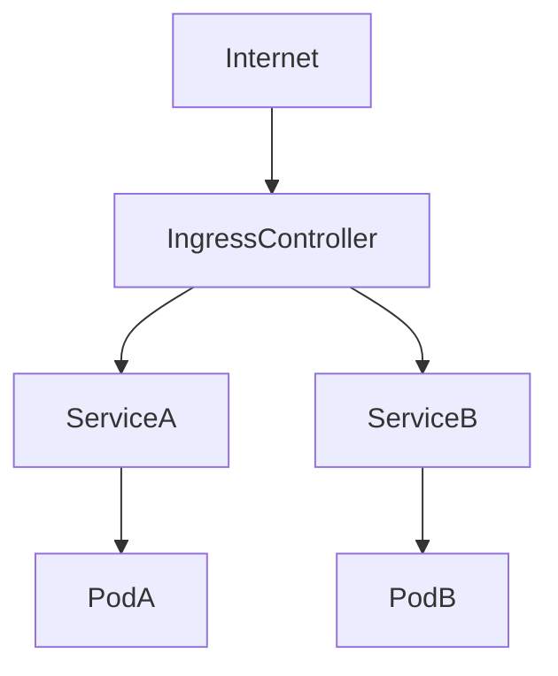
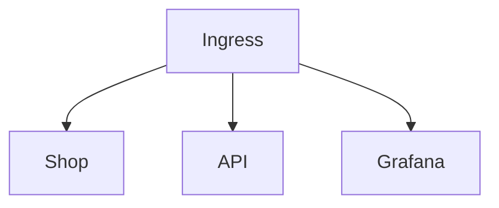
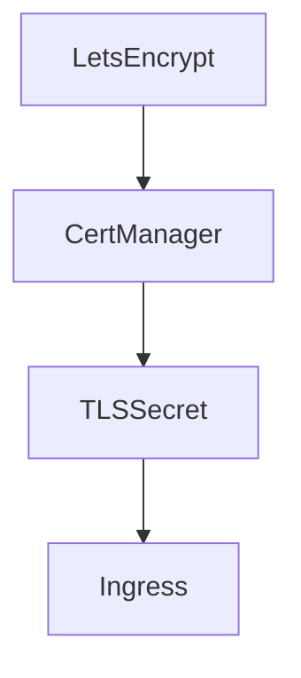

# Modul 8 – Ingress, TLS und Veröffentlichung (Professionelle Trainerunterlage)

## Dauer

- Theorie: 4 Stunden
- Hands-on Labs: 3 Stunden

## Lernziele

Nach diesem Modul können die Teilnehmer:

- Anwendungen sicher veröffentlichen
- Ingress und Ingress Controller verstehen
- Host- und Path-basiertes Routing konfigurieren
- TLS-Zertifikate einsetzen
- cert-manager nutzen
- typische Routing- und TLS-Probleme analysieren

---

# 1. Veröffentlichung von Anwendungen

Bisher:

```text
User
 ↓
NodePort
 ↓
Service
 ↓
Pod
```

Probleme:

- viele Ports
- kein zentrales Routing
- TLS schwierig

---

# 2. Was ist ein Ingress?

Ingress definiert HTTP- und HTTPS-Routing-Regeln.

Ingress selbst verarbeitet keinen Traffic.

Dafür wird ein Ingress Controller benötigt.

---

# Architektur



---

# 3. Ingress Controller

Bekannte Lösungen:

- NGINX Ingress Controller
- Traefik
- HAProxy
- Kong
- Contour

---

## NGINX Ingress

De-facto Standard.

Eigenschaften:

- stabil
- weit verbreitet
- umfangreiche Dokumentation

---

# 4. Erstes Ingress Objekt

```yaml
apiVersion: networking.k8s.io/v1
kind: Ingress
metadata:
  name: webshop
spec:
  rules:
  - host: webshop.example.com
    http:
      paths:
      - path: /
        pathType: Prefix
        backend:
          service:
            name: webshop
            port:
              number: 80
```

---

# 5. Host Based Routing

Mehrere Anwendungen über dieselbe IP.

```text
shop.example.com
api.example.com
grafana.example.com
```

---

## Beispiel



---

# 6. Path Based Routing

Routing über URL-Pfade.

```text
/shop
/api
/admin
```

---

## Beispiel

```yaml
path: /api
```

---

# 7. TLS Grundlagen

Ohne TLS:

```text
HTTP
```

Mit TLS:

```text
HTTPS
```

---

## Vorteile

- Verschlüsselung
- Integrität
- Authentizität

---

# 8. TLS Secret

Zertifikate werden als Secret gespeichert.

```bash
kubectl create secret tls tls-secret \
  --cert=tls.crt \
  --key=tls.key
```

---

# 9. TLS im Ingress

```yaml
tls:
- hosts:
  - webshop.example.com
  secretName: tls-secret
```

---

# 10. cert-manager

Automatisiert Zertifikate.

---

## Vorteile

- automatische Ausstellung
- automatische Erneuerung
- Let’s Encrypt Integration

---

# Architektur



---

# 11. ClusterIssuer

Clusterweite Zertifikatsquelle.

```yaml
apiVersion: cert-manager.io/v1
kind: ClusterIssuer
metadata:
  name: letsencrypt
```

---

# 12. Wildcard Zertifikate

Beispiel:

```text
*.example.com
```

Vorteile:

- weniger Zertifikate
- einfachere Verwaltung

---

# 13. Ingress Annotations

Steuern Controller-Verhalten.

Beispiel:

```yaml
annotations:
  nginx.ingress.kubernetes.io/rewrite-target: /
```

---

# 14. Load Balancer Integration

Cloud Plattformen:

- AWS ALB
- Azure Application Gateway
- GCP Load Balancer

---

# 15. Reverse Proxy Konzepte

Ingress Controller fungieren als Reverse Proxy.

Aufgaben:

- TLS Terminierung
- Routing
- Load Balancing

---

# 16. HTTP vs HTTPS

```text
HTTP
↓
Unverschlüsselt
```

```text
HTTPS
↓
TLS verschlüsselt
```

---

# 17. Sicherheit

Best Practices:

- TLS erzwingen
- alte Cipher deaktivieren
- HSTS aktivieren

---

# 18. Ingress Troubleshooting

Kontrollen:

```bash
kubectl get ingress
```

```bash
kubectl describe ingress
```

---

## Controller Logs

```bash
kubectl logs deployment/ingress-nginx-controller
```

---

# 19. DNS Integration

DNS muss auf den Ingress Controller zeigen.

```text
A Record
↓
Ingress IP
```

---

# Best Practices

## TLS überall

Immer HTTPS verwenden.

---

## cert-manager nutzen

Keine manuelle Zertifikatsverwaltung.

---

## Host Based Routing

Bessere Übersichtlichkeit.

---

## Monitoring

Ingress überwachen.

---

# Lab 1 – NGINX Ingress Controller

Controller installieren.

---

# Lab 2 – Erstes Ingress

Anwendung veröffentlichen.

---

# Lab 3 – Host Routing

Mehrere Anwendungen veröffentlichen.

---

# Lab 4 – Path Routing

API und Frontend trennen.

---

# Lab 5 – TLS Secret

Eigenes Zertifikat verwenden.

---

# Lab 6 – cert-manager

Let’s Encrypt Zertifikat beziehen.

---

# Lab 7 – TLS Fehleranalyse

Zertifikatsprobleme untersuchen.

---

# Lab 8 – DNS Integration

Ingress über DNS erreichbar machen.

---

# Troubleshooting

## 404 Fehler

Ingress Regeln prüfen.

```bash
kubectl describe ingress
```

---

## TLS Fehler

```bash
kubectl get secret
```

---

## DNS Fehler

```bash
nslookup webshop.example.com
```

---

## Kein Routing

Controller Logs analysieren.

---

# CKA/CKAD Übungen

1. Ingress erstellen.
2. Host Routing konfigurieren.
3. TLS aktivieren.
4. cert-manager nutzen.
5. DNS prüfen.

---

# Quiz

1. Was ist ein Ingress?
2. Warum wird ein Controller benötigt?
3. Unterschied Host- und Path-Routing?
4. Aufgabe von TLS?
5. Aufgabe von cert-manager?
6. Was ist ein ClusterIssuer?
7. Warum HTTPS erzwingen?

---

# Lösungen

1. Routing Definition
2. Verarbeitung des Traffics
3. Domain vs. URL Pfad
4. Verschlüsselung
5. Zertifikatsverwaltung
6. Zertifikatsquelle
7. Sicherheit

---

# Zusammenfassung

Die Teilnehmer verstehen:

- Ingress
- Ingress Controller
- Host Routing
- Path Routing
- TLS
- TLS Secrets
- cert-manager
- ClusterIssuer
- DNS Integration
- Reverse Proxies
- Troubleshooting

Nächstes Modul:

**Modul 9 – Helm und Paketmanagement**
