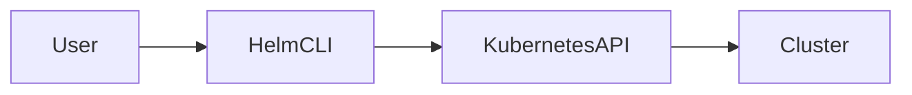
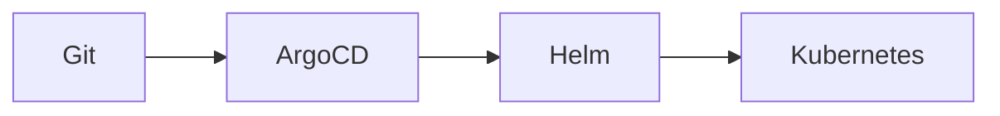
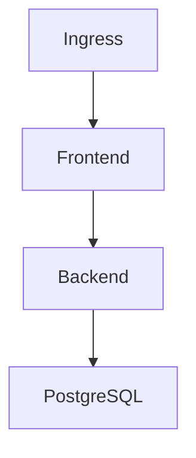

# Modul 9 – Helm und Kubernetes Paketmanagement (Professionelle Trainerunterlage)

## Dauer

- Theorie: 4 Stunden
- Hands-on Labs: 4 Stunden

## Lernziele

Nach diesem Modul können die Teilnehmer:

- Helm verstehen und einsetzen
- Helm Charts erstellen
- Templates und Values verwenden
- Releases verwalten
- Updates und Rollbacks durchführen
- Helm in GitOps-Prozesse integrieren

---

# 1. Warum Helm?

Ohne Helm:

```text
deployment.yaml
service.yaml
ingress.yaml
configmap.yaml
secret.yaml
```

Viele YAML-Dateien müssen einzeln verwaltet werden.

---

## Helm Lösung

```text
Chart
 ↓
Installieren
 ↓
Komplette Anwendung
```

---

# 2. Was ist Helm?

Helm ist der Paketmanager für Kubernetes.

Vergleich:

| Technologie | Paketmanager |
|-------------|-------------|
| Ubuntu | apt |
| RedHat | yum |
| Kubernetes | Helm |

---

# 3. Helm Architektur



---

# 4. Helm Installation

Prüfen:

```bash
helm version
```

Repository hinzufügen:

```bash
helm repo add bitnami https://charts.bitnami.com/bitnami
```

---

# 5. Helm Repositories

Suche:

```bash
helm search repo nginx
```

Update:

```bash
helm repo update
```

---

# 6. Erstes Chart installieren

```bash
helm install nginx bitnami/nginx
```

---

## Status

```bash
helm list
```

---

# 7. Helm Chart Struktur

```text
mychart/
├── Chart.yaml
├── values.yaml
├── charts/
└── templates/
```

---

# 8. Chart.yaml

Metadaten des Charts.

```yaml
apiVersion: v2
name: webshop
version: 1.0.0
```

---

# 9. values.yaml

Konfiguration.

```yaml
replicaCount: 3

image:
  repository: nginx
  tag: latest
```

---

# 10. Templates

Helm verwendet Go Templates.

Beispiel:

```yaml
replicas: {{ .Values.replicaCount }}
```

---

# 11. Template Funktionen

Beispiele:

```yaml
{{ upper "hello" }}
```

```yaml
{{ default "nginx" .Values.image }}
```

---

# 12. Helm Rendering

Rendern ohne Deployment:

```bash
helm template mychart
```

---

## Vorteil

YAML vor Deployment prüfen.

---

# 13. Releases

Installation erzeugt Release.

```bash
helm list
```

---

## Informationen

```bash
helm status nginx
```

---

# 14. Upgrades

Chart aktualisieren.

```bash
helm upgrade nginx ./mychart
```

---

# 15. Rollbacks

Historie:

```bash
helm history nginx
```

Rollback:

```bash
helm rollback nginx 1
```

---

# 16. Chart Dependencies

Abhängigkeiten definieren.

```yaml
dependencies:
- name: postgresql
```

---

## Beispiel

```text
Webshop
 ├─ PostgreSQL
 └─ Redis
```

---

# 17. Subcharts

Komplexe Anwendungen modularisieren.

---

# 18. Helm Hooks

Lifecycle Events.

Beispiele:

```text
pre-install
post-install
pre-upgrade
post-upgrade
```

---

# 19. Helm Tests

Test Ressourcen definieren.

```bash
helm test nginx
```

---

# 20. Helm Security

Best Practices:

- Charts signieren
- Images scannen
- Values validieren

---

# 21. OCI Registries

Moderne Helm Distribution.

```bash
helm push chart.tgz oci://registry.example.com
```

---

# 22. Helm und GitOps

Werkzeuge:

- ArgoCD
- FluxCD

---

## Workflow



---

# 23. Beispielanwendung

Architektur:



---

## Komponenten

- Frontend
- Backend
- PostgreSQL
- ConfigMap
- Secret
- PVC
- Ingress

---

# 24. Helm Chart für die Beispielanwendung

Templates:

```text
deployment.yaml
service.yaml
ingress.yaml
secret.yaml
configmap.yaml
```

---

# 25. Helm Best Practices

## Werte auslagern

```yaml
values.yaml
```

---

## Wiederverwendbare Templates

```yaml
_helpers.tpl
```

---

## Versionierung

Semantic Versioning.

```text
1.0.0
1.1.0
2.0.0
```

---

# Lab 1 – Helm installieren

Version prüfen.

---

# Lab 2 – Chart erzeugen

```bash
helm create webshop
```

---

# Lab 3 – Values anpassen

Replica Anzahl ändern.

---

# Lab 4 – Template Rendering

```bash
helm template webshop
```

---

# Lab 5 – Upgrade

Release aktualisieren.

---

# Lab 6 – Rollback

Vorherige Version wiederherstellen.

---

# Lab 7 – Dependency

PostgreSQL als Dependency einbinden.

---

# Lab 8 – OCI Registry

Chart veröffentlichen.

---

# Lab 9 – GitOps

Helm über ArgoCD deployen.

---

# Troubleshooting

## Template Fehler

```bash
helm template
```

---

## Upgrade Fehler

```bash
helm history
```

---

## Values Problem

```bash
helm get values nginx
```

---

## Release Fehler

```bash
helm status nginx
```

---

# CKA/CKAD Übungen

1. Chart erstellen.
2. Values konfigurieren.
3. Upgrade durchführen.
4. Rollback durchführen.
5. Dependency hinzufügen.

---

# Quiz

1. Was ist Helm?
2. Aufgabe von values.yaml?
3. Aufgabe von Templates?
4. Was ist ein Release?
5. Unterschied Upgrade und Rollback?
6. Warum Dependencies?
7. Warum Helm in GitOps?

---

# Lösungen

1. Paketmanager für Kubernetes
2. Konfiguration
3. YAML Generierung
4. Installierte Chart Instanz
5. Vorwärts vs. Rückwärts
6. Wiederverwendung
7. Standardisierte Deployments

---

# Zusammenfassung

Die Teilnehmer verstehen:

- Helm Grundlagen
- Repositories
- Charts
- Templates
- Values
- Releases
- Upgrades
- Rollbacks
- Dependencies
- Hooks
- OCI Registries
- GitOps Integration
- Beispielanwendung mit Helm

Ende der Kubernetes Grundlagenschulung.
